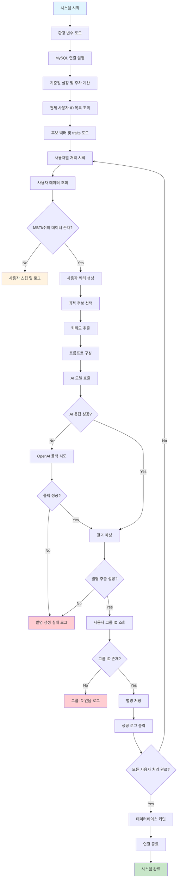
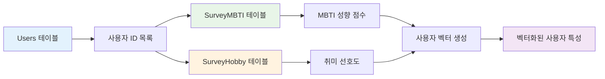
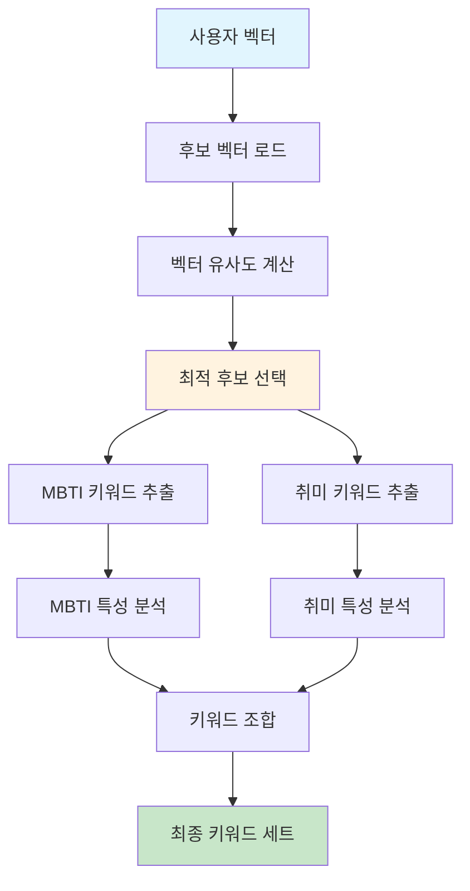
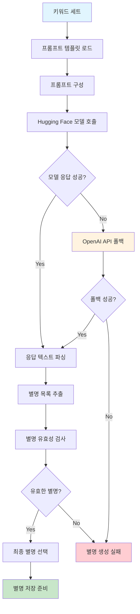
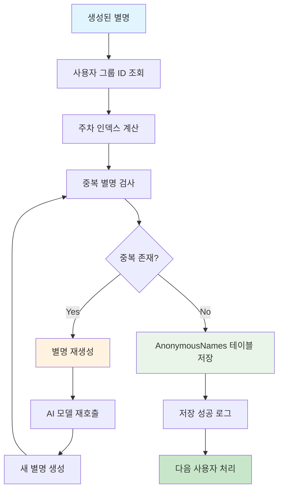
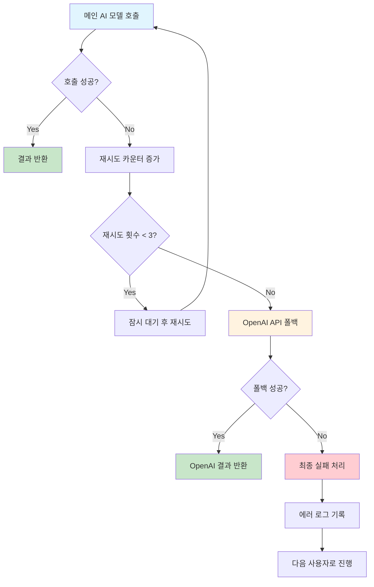
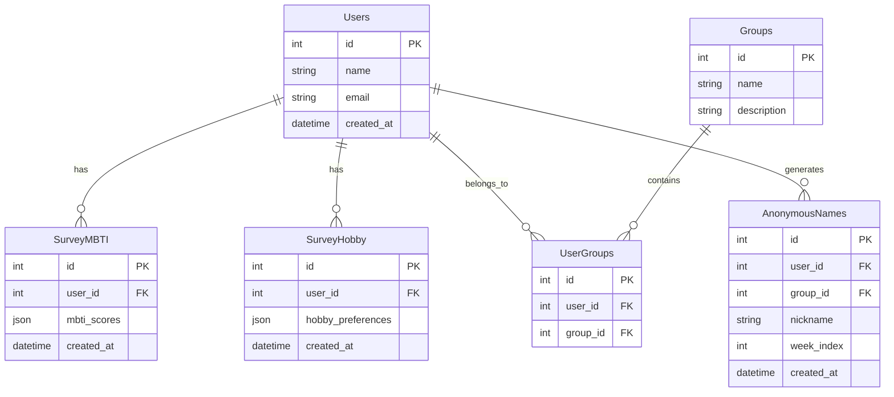

#  AI 기반 개인화 별명 생성 시스템

사용자의 MBTI 성향과 취미를 기반으로 AI가 개인화된 별명을 생성하는 시스템입니다.

##  프로젝트 개요

이 프로젝트는 사용자의 MBTI 성향과 취미 데이터를 분석하여 벡터화하고, AI 모델을 통해 개인에게 맞는 창의적인 별명을 자동으로 생성하는 파이프라인입니다.

### 주요 기능
-  **사용자 데이터 분석**: MBTI 성향과 취미 데이터 수집 및 분석
-  **벡터 매칭**: 사용자 특성을 벡터화하여 최적의 후보 선택
-  **AI 별명 생성**: Hugging Face 모델을 활용한 창의적 별명 생성
-  **데이터 저장**: MySQL 데이터베이스에 생성된 별명 저장
-  **주차별 관리**: 주차 인덱스를 통한 별명 관리

##  프로젝트 구조

```
nickname-deep/
├── 📁 data/                          # 데이터 파일
│   ├── candidate_vectors01.pkl       # 후보 벡터 데이터
│   ├── hobby_traits.json            # 취미 특성 데이터
│   ├── mbti_animal.json             # MBTI-동물 매핑 데이터
│   └── mbti_traits_with_binary_vector.json  # MBTI 특성 벡터 데이터
├── 📁 modules/                       # 핵심 모듈
│   ├── candidate_selector.py        # 후보 선택 로직
│   ├── keyword_extractor.py         # 키워드 추출
│   ├── llm_caller.py               # LLM 호출 인터페이스
│   ├── mysql_loader.py             # MySQL 데이터 로더
│   ├── mysql_saver.py              # MySQL 데이터 저장
│   ├── nickname_generator.py       # 별명 생성기
│   ├── openai_fallback.py          # OpenAI 폴백 처리
│   ├── prompt_builder.py           # 프롬프트 빌더
│   ├── result_parser.py            # 결과 파서
│   └── user_vector.py              # 사용자 벡터 생성
├── 📁 utils/                        # 유틸리티
│   └── week_index.py               # 주차 인덱스 계산
├── main_pipelne.py                 # 메인 파이프라인
├── test_pipeline.py                # 테스트 스크립트
├── retry_openai_only.py            # OpenAI 재시도 로직
├── test_mysql.py                   # MySQL 연결 테스트
└── requirements.txt                # 의존성 패키지
```

##  설치 및 실행

### 1. 환경 설정

```bash
# 저장소 클론
git clone <repository-url>
cd nickname-deep

# 가상환경 생성 및 활성화
python -m venv venv
source venv/bin/activate  # Windows: venv\Scripts\activate

# 의존성 설치
pip install -r requirements.txt
```

### 2. 환경 변수 설정

`.env` 파일을 생성하고 다음 변수들을 설정하세요:

```env
# MySQL 설정
MYSQL_HOST=your_mysql_host
MYSQL_USER=your_mysql_user
MYSQL_PASSWORD=your_mysql_password
MYSQL_DATABASE=your_database_name

# Hugging Face 토큰 (선택사항)
HF_TOKEN=your_huggingface_token

# OpenAI API 키 (폴백용)
OPENAI_API_KEY=your_openai_api_key
```

### 3. 실행

```bash
# 메인 파이프라인 실행
python main_pipelne.py

# 테스트 실행
python test_pipeline.py

# MySQL 연결 테스트
python test_mysql.py
```

##  핵심 모듈 설명

###  데이터 처리 모듈

- **`mysql_loader.py`**: 사용자의 MBTI와 취미 데이터를 MySQL에서 로드
- **`user_vector.py`**: 사용자 특성을 벡터화하여 분석 가능한 형태로 변환
- **`candidate_selector.py`**: 벡터 유사도를 기반으로 최적의 후보 선택

###  AI 생성 모듈

- **`keyword_extractor.py`**: MBTI와 취미에서 키워드 추출
- **`prompt_builder.py`**: AI 모델용 프롬프트 구성
- **`llm_caller.py`**: Hugging Face 모델 호출 인터페이스
- **`result_parser.py`**: AI 응답에서 별명 추출 및 파싱

###  데이터 저장 모듈

- **`mysql_saver.py`**: 생성된 별명을 MySQL에 저장
- **`nickname_generator.py`**: 고유한 별명 생성 및 중복 검사

###  폴백 및 유틸리티

- **`openai_fallback.py`**: 메인 모델 실패 시 OpenAI API 폴백
- **`week_index.py`**: 주차별 데이터 관리용 인덱스 계산

##  파이프라인 흐름

###  전체 시스템 흐름도



### 🔍 데이터 처리 단계별 상세 흐름

#### 1️. **사용자 데이터 수집 단계**


#### 2️. **후보 매칭 및 키워드 추출 단계**


#### 3️. **AI 모델 호출 및 결과 처리 단계**


#### 4️. **데이터 저장 및 관리 단계**


###  에러 처리 및 폴백 메커니즘


###  데이터베이스 스키마 관계



##  기술 스택

### 백엔드
- **Python 3.8+**: 메인 프로그래밍 언어
- **MySQL**: 사용자 데이터 및 결과 저장
- **PyMySQL**: MySQL 연결 및 쿼리 처리

### AI/ML
- **Hugging Face Transformers**: 메인 AI 모델 (HyperCLOVAX-SEED)
- **OpenAI API**: 폴백 AI 서비스
- **Sentence Transformers**: 벡터 유사도 계산
- **Scikit-learn**: 데이터 처리 및 분석

### 유틸리티
- **python-dotenv**: 환경 변수 관리
- **NumPy**: 수치 계산
- **Pandas**: 데이터 조작

##  데이터 구조

### 입력 데이터
- **MBTI 성향**: 16가지 MBTI 유형별 특성 점수
- **취미 데이터**: 사용자 선호 취미 목록
- **사용자 정보**: 기본 사용자 프로필

### 출력 데이터
- **생성된 별명**: AI가 생성한 개인화된 별명
- **주차 인덱스**: 별명 생성 시점의 주차 정보
- **그룹 정보**: 사용자 소속 그룹

##  테스트

```bash
# 전체 파이프라인 테스트
python test_pipeline.py

# MySQL 연결 테스트
python test_mysql.py

# OpenAI 폴백 테스트
python retry_openai_only.py
```

##  문제 해결

### 일반적인 문제들

1. **MySQL 연결 실패**
   - `.env` 파일의 데이터베이스 정보 확인
   - 네트워크 연결 상태 확인

2. **AI 모델 로딩 실패**
   - Hugging Face 토큰 설정 확인
   - 인터넷 연결 상태 확인

3. **메모리 부족**
   - 배치 크기 조정
   - 가상환경 메모리 할당 증가

